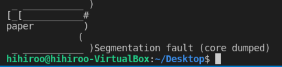
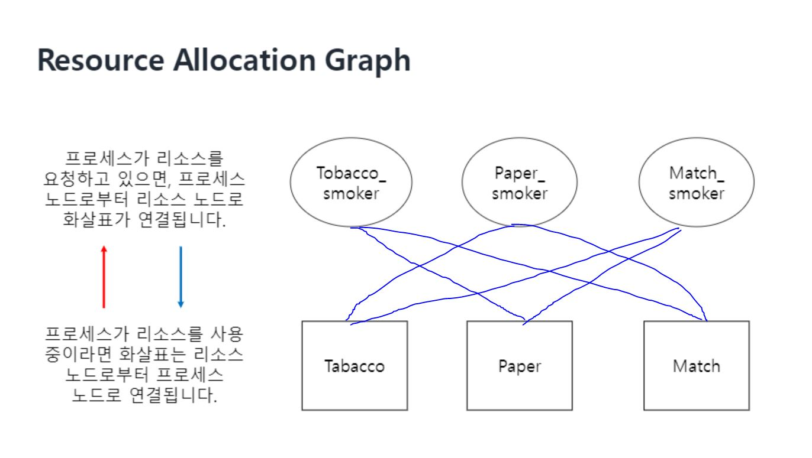
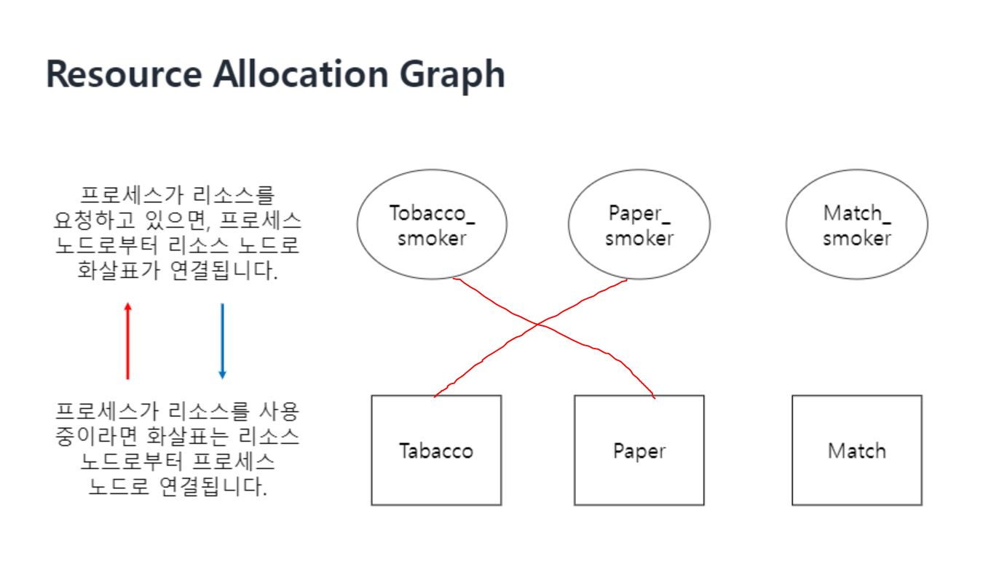

# 실행 결과 분석 및 솔루션

## **(공급자) 코드 설명**
```c
switch (turn) {
    case 0:
        sem_post(tabacco);
        sem_post(paper);
        break;
    case 1:
        sem_post(paper);
        sem_post(matches);
        break;
    case 2:
        sem_post(matches);
        sem_post(tabacco);
        break;
    default:
        break;
}
/*
* 흡연자가 담배를 다 피울 때까지 기다린다.
*/
sem_wait(done);
```
공급자는 2개의 자원을 준비하여 post한다. 흡연자가 흡연을 끝내고 done을 post할 때까지 기다린다.

<br><br>

## **코드 결과**
<p align="center"></p>

Linux 환경에서 실행하면 Segmentation fault가 뜨면서 실행이 종료되고, Mac OS에서 실행하면 10초가 아닌 중간에 프로그램이 종료된다.

<br><br>

## **코드 분석**
<p align="center"></p>

각 흡연자는 2개의 자원을 필요로 한다. 즉, 하나의 자원을 2명의 흡연자가 동시에 필요로 하는 경우가 발생한다. <br>
하나의 자원을 두고 두 명의 흡연자가 경쟁하게 되는 것이다.
<br>

따라서 공급자가 준비한 2개의 자원이 모두 한 사람에게 돌아가는 것이 아닌 두 사람에게 따로 따로 분배되는 경우가 발생할 수 있다.

<p align="center"></p>

이런 경우, 두 명의 흡연자 모두 나머지 하나의 자원을 얻지 못해 흡연을 하지 못한다. <br>
즉, 모든 흡연자가 흡연을 하지 않았으므로 공급자에게 done 신호를 보내지 못한다. <br> 공급자는 done 신호를 받지 못했으므로 더 이상 자원을 공급하지 않고, 흡연자는 필요한 자원을 공급받지 못하므로 데드락(Dead Lock)이 발생한다.

<br><br>

## **Solution**
```c
// 공급자
switch (turn) {
    case 0:
        sem_post(tabacco);
        break;
    case 1:
        sem_post(paper);
        break;
    case 2:
        sem_post(matches);
        break;
    default:
        break;
}
sem_wait(done);
```
```c
//성냥만 가지고 있는 흡연자
void *matches_smoker(void *arg)
{
    while (1) { 
        sem_wait(matches);
        smoke();
        sem_post(done);
    }
}
```
알고리즘은 다음과 같다.<br>
공급자는 2개의 자원이 준비되면 바로 흡연을 할 수 있는 한 사람에게만 시그널을 보낸다.

예를 들어,
공급자가 담뱃잎, 종이가 준비되면 불을 가지고 있는 사람에게 시그널을 보낸다. <br>
각 흡연자는 공급자가 자신을 부르기를 기다리다가 흡연을 하고 공급자에게 종료 신호를 보낸다.
