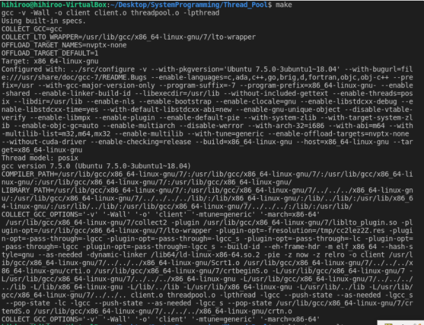
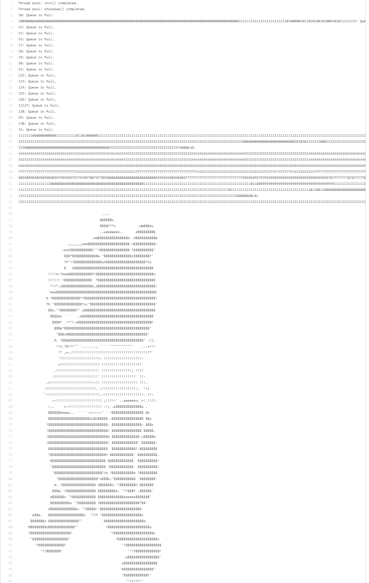

# Operating Systems Project #4


## 1. 알고리즘

---

### 1.1. 구현 목표

- 3개의 스레드가 있는 스레드 풀을 생성하여 대기열에 있는 작업들을 실행하도록 한다.
- 세마포를 생성하여 대기열에 작업이 없는 경우 스레드가 쉴 수 있도록, 대기 중인 작업이 있을 때만 스레드가 일을 할 수 있도록 한다.
- 대기열에서 작업을 뺄 때 생기는 빈 공간에도 새로운 작업이 들어올 수 있도록 대기열을 원형큐로 구현한다.

### 1.2. 실행 순서 및 알고리즘

1. **pool_init()** 함수를 호출하여 스레드 풀을 초기화 한다.

```c
void pool_init(void)
{
    front = -1, rear = -1, cnt = 0; // 큐 비우기
    pthread_mutex_init(&mutex, NULL); // 대기열 변경 및 조회를 위한 뮤텍스 락 초기화
    sem = sem_open("sem", O_CREAT, 0644, 0); // 세마포 초기화

    for(int i=0; i<NUMBER_OF_BEES; i++){
        pthread_create(&bee[i],NULL,worker,NULL); // 작업을 수행할 스레드 생성
    }
}
```

 2.  client가 **pool_submit()** 함수를 호출하여 대기열에 작업을 push한다.

```c
int pool_submit(void (*f)(void *p), void *p)
{
    task_t task = {.function = f, .data = p};

    int failed = enqueue(task); // 대기열에 작업을 push한다.
    if(!failed) sem_post(sem); // push에 성공하면 세마포 값을 1 늘린다.

    return failed;
}
```

 3.  스레드들이 대기열에 있는 작업을 꺼내어 실행한다.

```c
static void *worker(void *param)
{
    while(1){
				// 대기열에 작업이 없는 경우 기다리고,
				// 작업을 시작하면서 세마포 값을 1 줄인다.
        sem_wait(sem); 
        
        task_t task; 
				
				// 대기열을 변경, 조회할 때는 하나의 스레드만 접근 가능하도록 한다.
        pthread_mutex_lock(&mutex);
        int failed = dequeue(&task); // 대기열에서 작업을 꺼내 task에 저장한다.
        pthread_mutex_unlock(&mutex);
        
        if(!failed) task.function(task.data); // 작업을 실행한다.
    }
    pthread_exit(0);
}
```

4. 모든 작업이 끝나면 client는 **pool_shutdown()**을 호출하여 스레드를 종료하고, 락과 세마포를 제거한다.

```c
void pool_shutdown(void)
{
    for(int i=0; i<NUMBER_OF_BEES; i++){ // 일꾼 스레드 취소 및 종료
        pthread_cancel(bee[i]);
        pthread_join(bee[i],NULL);
    }

    pthread_mutex_destroy(&mutex); // 뮤텍스 락 제거
    sem_close(sem); // 세마포 제거
    sem_unlink("sem");
}
```

### 1.3. 대기열 구현

```c
/* 
대기열에 있는 작업의 수를 cnt에 저장하여 대기열이 비었는지, 꽉찼는지 구분한다.
*/
static int isFull(){
    return cnt == QUEUE_SIZE;
}

static int isEmpty(){
    return cnt == 0;
}

/* 
rear는 마지막 작업의 위치를 가리킨다. 
따라서 대기열에 작업을 추가할 때는 마지막 작업의 다음 위치에 넣어준다.
*/
static int enqueue(task_t t)
{
     if(isFull()) return 1;
     rear = (rear+1) % QUEUE_SIZE;
     worktodo[rear] = t;
     cnt++;

     return 0;
}
/* 
front는 가장 처음 들어온 작업의 앞을 가리킨다.
즉, 가장 앞의 작업을 빼내기 위해서 front에 1을 더해준다.
*/
static int dequeue(task_t *t)
{
    if(isEmpty()) return 1;
    front = (front+1) % QUEUE_SIZE;
    *t = worktodo[front];
    cnt--;
    return 0;
}
```

## 2. 소스코드

---

```c
//threadpool.c
#include <pthread.h>
#include <stdio.h>
#include <fcntl.h>           /* For O_* constants */
#include <sys/stat.h>        /* For mode constants */
#include <semaphore.h>
#include "threadpool.h"

#define QUEUE_SIZE 10
#define NUMBER_OF_BEES 3

typedef struct {
    void (*function)(void *p);
    void *data;
} task_t;

static task_t worktodo[QUEUE_SIZE];
int front, rear, cnt; // 원형 큐의 front, rear, 큐 사이즈
static pthread_mutex_t mutex;
static pthread_t bee[NUMBER_OF_BEES];
static sem_t *sem;

static int isFull(){
    return cnt == QUEUE_SIZE;
}

static int isEmpty(){
    return cnt == 0;
}

static int enqueue(task_t t)
{
     if(isFull()) return 1;
     rear = (rear+1) % QUEUE_SIZE;
     worktodo[rear] = t;
     cnt++;

     return 0;
}

static int dequeue(task_t *t)
{
    if(isEmpty()) return 1;
    front = (front+1) % QUEUE_SIZE;
    *t = worktodo[front];
    cnt--;
    return 0;
}

static void *worker(void *param)
{
    while(1){
        sem_wait(sem); // 대기열에 작업이 있는 경우 실행
        
        task_t task; 

        pthread_mutex_lock(&mutex);
        int failed = dequeue(&task);
        pthread_mutex_unlock(&mutex);
        
        if(!failed) task.function(task.data);
    }
    pthread_exit(0);
}

int pool_submit(void (*f)(void *p), void *p)
{
    task_t task = {.function = f, .data = p};

    pthread_mutex_lock(&mutex);
    int failed = enqueue(task); // 대기열에 실행할 함수 push
    if(!failed) sem_post(sem);
    pthread_mutex_unlock(&mutex);

    return failed;
}

void pool_init(void)
{
    front = -1, rear = -1, cnt = 0; // 큐 비우기
    pthread_mutex_init(&mutex, NULL); 
    sem = sem_open("sem", O_CREAT, 0644, 0);

    for(int i=0; i<NUMBER_OF_BEES; i++){
        pthread_create(&bee[i],NULL,worker,NULL);
    }
}

void pool_shutdown(void)
{
    for(int i=0; i<NUMBER_OF_BEES; i++){
        pthread_cancel(bee[i]);
        pthread_join(bee[i],NULL);
    }

    pthread_mutex_destroy(&mutex);
    sem_close(sem); 
    sem_unlink("sem");
}
```

## 3. 컴파일 및 출력 결과

---





[전체 출력 보기](https://github.com/hihiroo/SystemProgramming/blob/master/Thread_Pool/result.txt)

## 4. 결과 분석

---

10번째 작업에서 Queue is full이 출력되고 숫자가 출력되다가 다시 13번째 작업에서 Queue is full이 출력되고 있다. 대기열의 길이가 10이기 때문에 0번째부터 9번째까지 대기열에 들어가고 10번째는 들어가지 못했다가 작업이 끝나 대기열이 비면서 11번째 부터 다시 대기열에 들어가고 있다. 마지막에는 푸의 모습이 완전하게 나오고 있는데 이는 나머지 2개의 스레드가 donothing 함수에 들어가 아무 작업도 하지 않으면서 방해 없이 출력할 수 있었기 때문이다.